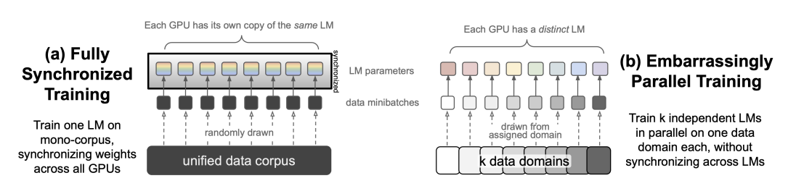
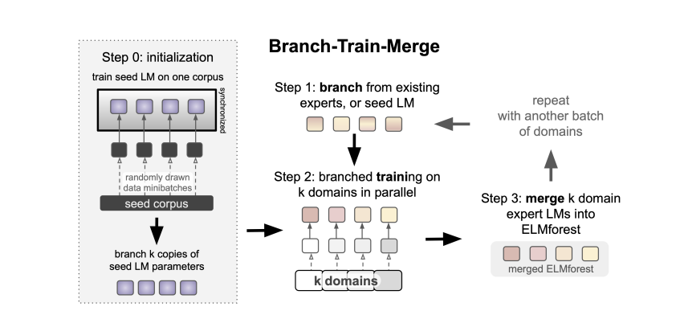

# Branch-Train-Merge: Embarrassingly Parallel Training of Expert Language Models

# Abstract

私たちは、大規模言語モデル（LLMs）の大規模並列訓練のための通信効率の高いアルゴリズムである**Branch-Train-Merge (BTM)** を提案します。

この手法では、現在LLMsを訓練するために必要な大規模な多ノード同期を排除し、LLMsの新しいクラスの一部を異なるデータサブセット上で独立して訓練することが可能です。

BTMは、専門的なLLM（**EXPERT LMs**, ELMs）の独立したセットを学習します。

これらは、科学や法律のテキストなど、それぞれ異なるテキストドメインに特化しています。

これらのELMは、データカバレッジを更新するために追加および削除されたり、新しいドメインに一般化するために集約され、効率的な推論のために単一のLMに戻されたりします。

新しいELMは、現在のセット内のELM（またはその組み合わせ）から「分岐（branching）」することで学習され、新しいドメインのデータでパラメータをさらに訓練し、将来の使用のためにその結果のモデルをセットに統合します。

実験では、BTMがGPTスタイルのTransformer LMsと比較して、訓練コストを制御した場合に、ドメイン内およびドメイン外のperplexityを改善することを示しています。

広範な分析を通じて、これらの結果が異なるELM（Expert Language Model）の初期化スキームに対して頑健であることを示しましたが、専門分野に特化した専門的なドメインの必要性があることも明らかになりました。

一方で、ランダムなデータ分割を用いたLM（言語モデル）のアンサンブルは良好な性能を発揮しませんでした。

さらに、BTMを新しい64ドメインのコーパス（合計192B（1920億）の空白区切りトークン）にスケーリングする研究を提示します。

その結果、22.4B（224億）パラメータを持つLMは、2.5倍の計算リソースを使用して訓練されたTransformer LMと同等の性能を示しました。

これらの成果は、ドメインの数が増えるにつれて得られるものであり、将来の研究において、より積極的な並列化が使用されることで、より大きなモデルを効率的に訓練できる可能性を示唆しています。

# 1.Introduction

大規模な言語モデル（LM）のトレーニングおよび推論には、通常、モデルの活性化および勾配を計算するために必要な大規模なマルチノード（例: GPUやTPU）の同期を実現できるスーパーコンピュータへのアクセスが必要です（Brownら, 2020; Zhangら, 2022; Fedusら, 2022; Lepikhinら, 2021）。

本論文では、代わりに「embarrassingly parallel」な新しいクラスの大規模言語モデル（LM）を開発しました。

このモデルでは、モデルの異なる部分がデータの異なるサブセットで独立してトレーニングされ、マルチノードでのトレーニングや推論を必要としません（図2参照）。

---

図2: 完全同期型トレーニングと非常に並列化可能なトレーニング（§3）。

(a) TRANSFORMER-LMの完全同期型データ並列トレーニングでは、すべてのパラメータがすべてのGPU間で同期されます。大規模なLMでは、この同期により膨大なノード間通信コストが発生します。

(b) embarrassingly parallelなトレーニング（本研究）では、個々のモデルが各ドメインでトレーニングされ、これらのモデル間でパラメータの同期は行われないため、モデル間のノード間通信コストが排除されます。

---

私たちの新しい ELMFOREST(Expert Language Models For Efficient Sparse Training) モデルは、専門家言語モデル（ELM: Expert Language Models）の集合で構成されており、それぞれがトレーニングコーパス内の異なるドメイン（例えば科学文献や法律文書）に特化しています。

これらのELMは、それぞれが独立して機能するLMであり、以前のドメインMixture-of-Experts（MoE）モデルのようにTransformerのフィードフォワード層だけを特化させるのではなく、パラメータを共有しません（Gururanganら, 2022）。

ELMは、データカバレッジを更新するためにモデルに追加したり削除したりでき、新しいドメインへの一般化のためにアンサンブルとして使用したり、効率的な推論のために単一のLMに戻すためにパラメータを平均化したりすることが可能です。

私たちは、このセットの専門化された言語モデル（LM）を学習するための Branch-Train-Merge (BTM) アルゴリズムを提案します。

この手法では、複数の新しいELM（専門化された言語モデル）を完全に並列で追加することで、ELMFORESTを繰り返し拡張します。

ELMFOREST内の新しいELMは、現在のセット内で最も関連性の高いLMのパラメータを平均して新しいLMを初期化し、次に新しいドメインデータを用いて標準的なクロスエントロピー損失でさらにトレーニングされ、最後に現在のELMFORESTに単純に追加することでモデルに統合されます（図3はこのプロセスの概要を示しています）。

---

Figure 3: **BTM トレーニングプロセスの概要 (§3)**  

私たちのBTM手法は、シードトレーニングフェーズ（Step 0）から開始されます。

このフェーズでは、単一のLMがコーパス上でトレーニングされます。このトレーニング結果のパラメータは分岐（Step 1）またはコピーされ、k回繰り返され、それぞれのLMが割り当てられた異なるデータドメインでトレーニングを続けます（Step 2）。

これにより、k個のELMが生成されます。トレーニングされたELMはELMFORESTに統合されます（Step 3）。

このプロセスは、既存のELMのパラメータ平均を用いて新しいELMを初期化するStep 1から繰り返すことが可能です。

シードフェーズ（Step 0）の後、ELMは完全に分離され、相互に通信することはありません。

このプロセスは、簡単のためk = 4の場合として示されていますが、§4-5の実験ではk = 8のドメインを用いてBTMを1回反復しています。§6で説明される実験設定（Figure 6に示されています）では、64のドメインでBTMを4回反復してトレーニングしています。

---

BTMは、将来のドメイン専門化のために強力な共有表現を確立する目的で、異質なデータでトレーニングされた単一のLMから初期化されます。このプロセスについては、詳細にアブレーション分析で検討しています。

ドメイン内およびドメイン外で評価した際、BTMを使用してトレーニングされたELMFORESTは、モノリシックなGPTスタイルのトランスフォーマーLM（GPT-LM）や、以前のドメイン専門化されたMixture-of-Expertsのベースライン（DEMIX; Gururangan et al., 2022）を、さまざまな計算予算において上回る結果を示しました。具体的には、ELMごとに最大13億パラメータ、総計7000 GPU時間を費やしてトレーニングした結果（図1; §4.2）。これらの改善は、すべてのモデルパラメータを使用するELMFORESTアンサンブルで特に顕著ですが、パラメータを平均化してモデルを統合した場合でも保持されます。

# 2 ELMFORESTs  

ELMFORESTは、embarrassingly parallelかつ（Figure 2）で、異なるデータ分割の影響を完全に分離して異なるLMに割り当てることで迅速にカスタマイズ可能なように設計されています。

本セクションではその定義を説明します。

# 2.1 モデルの定義  

ELMFORESTは、一連の専門特化型LM（ELM）で構成されており、それぞれがコーパスの異なる部分集合に特化するよう独立してトレーニングされます。

ELMは、初期のMoE（Mixture of Experts）モデル（Jacobs et al., 1991）の専門家のアイデアに触発されていますが、我々の定義では、モデルコンポーネントのみではなくLM全体が特定ドメインに特化する点が異なります。

Gururangan et al. 2022 に従い、ドメインは出所（provenance）、つまり文書の出典元（例えば、法的文書やコンピュータサイエンスの研究論文かどうか）によって定義されます。

これにより、シンプルで解釈可能なコーパスのセグメンテーションが得られ、実験におけるELMの特定に役立ちます。
  
これらのセグメンテーションは将来的に多言語・多モーダル・多タスク、または他のデータ分割にも拡張可能ですが、それは今後の課題として残します。

ELMはトレーニングと推論のすべての段階で独立性を保つため、以下に説明するような機能を可能にします。

# 2.2 ELMの追加と削除  

ELMFORESTのドメインカバレッジは、異なるドメインに特化した新しいELMを組み込むか、既存のELMをセットから削除することで、いつでも変更可能です。

これらのメカニズムは、LMの動作を特定の方向に向ける（Keskar et al., 2019; Gururangan et al., 2020; Dathathri et al., 2020）あるいは逆に特定の動作を抑制する（Welleck et al., 2019）既存の制御手法とは対照的です。

既存の手法はコストが高く、異なる目的でモデルを再トレーニングする必要があるか、テスト時のLMの動作について強い保証を提供しない場合が多いです（Gehman et al., 2020）。  

これに対して、ELMFORESTはトレーニングデータの出所に関する制約を推論時に明確に適用することを可能にします。

各ELMは関連するドメインのすべての情報を格納し、他のELMとは完全に独立しています。

モデルを完全にトレーニングした後であっても、特定の専門家を削除すれば、関連するデータは完全に除去され、将来のモデルの予測に影響を与えないことが保証されます。

私たちは、BTMトレーニングを計算リソースが一致するベースラインと比較し、その効率性の向上を慎重に測定しました。BTMトレーニングの最も単純な形式を用い、8つのドメイン (\(k = 8\)) のセットでの1回のBranch-Train-Mergeサイクルを通じて行いました。異なるパラメータ平均化手法を使用して、アンサンブル化および異なるモデル出力の推論を比較しました。

# 2.3 ELMFORESTのアンサンブル化

ELMFORESTは、モデルの効率性と性能の間でトレードオフを行う2つの推論モードをサポートします。

最初の方法では、複数のELMの出力確率をアンサンブル化します。

これにより、未知のドメイン起源の新しいテキストに一般化することが可能になります。

Gururangan et al. (2022) によって提案されたキャッシュされた事前確率法を使用し、以下にまとめられています。

確率的な観点から言語モデルを考慮し、次の条件付き分布を以下のように定義します：

$p(X_t | x_{<t}) = \sum_{j=1}^n p(X_t | x_{<t}, D = j) \cdot p(D = j | x_{<t})$

ここで、各シーケンスに沿ってドメイン変数 $D$ を導入します。

# ドメイン事後確率の推定

ベイズの法則を使用して、シーケンスが $k$ ドメインの各ドメインに属する確率を以下のように計算します：

$p(D = j | x_{<t}) = \frac{p(x_{<t} | D = j) \cdot p(D = j)}{p(x_{<t})} = \frac{p(x_{<t} | D = j) \cdot p(D = j)}{\sum_{j'=1}^k p(x_{<t} | D = j') \cdot p(D = j')}$

ELMは、ドメインラベルが与えられた場合の文脈全体にわたる尤度を計算するために使用されます。

キャッシュされた事前確率を計算するために、ドメイン全体の事後確率の指数移動平均を維持し、各シーケンスブロックの終わりで更新します：

$p(D = j) = \sum_{i=1}^N \lambda^i \cdot p(D = j | x^{(i)}_{<T})$

Gururangan et al. (2022) に従い、開発データの長さ $T = 1024$ のシーケンス100個 ($N = 100$) を使用し、EMAの減衰率を $\lambda = 0.3$ に設定しました。

この事前確率は、各ドメインのテスト時に固定されます。

この推論手法は、ELMFOREST内のすべてのELMを1回通過する必要がありますが、実際にはドメイン事後確率がスパースであることが観察されます。

これは、ELMの数が増加しても同様であり、トップ\(k\)のエキスパートELMの選択が推論時間コストをほとんど影響せずに削減できることを示唆しています。

私たちは、このスパース性と、トップ$k$のエキスパートを使用する有効性を拡張実験 (§6.5) で定量化します。

# 2.4 ELMパラメータの平均化

アンサンブル化の代替手段として、パラメータの平均化を使用してELMFORESTを単一のLMに縮約することもできます。この操作により、セットに追加されるELMの数に関係なく、推論コストが一定に保たれます。ELMFORESTを多くのドメインに拡張する際にも、ELMFORESTのパラメータ平均化を使用して新しいエキスパートを初期化します。次のセクションで示すように、ターゲットドメインに対する平均を使用し、最良のパフォーマンスを示すエキスパートも含めるさまざまな手法を用いて実験しました。§4.4のように、キャッシュされた事前確率 (§2.3) を使用して重み付け平均を定義する方法が最も強力であることがわかりました。

ELMFOREST重み付けパラメータ平均化は、すべてのモデルサイズでTransformer-LMベースラインより優れており、ELMFORESTアンサンブルの性能が大きなドメイン数で向上することを示しています (§6.5)。

# 4.1 実験設定

### データ
過去の研究に従い、Gururangan et al. (2022) によって導入されたデータを使用しました。このデータは、8つのトレーニングドメインと8つの評価ドメイン（主に英語のデータ）で構成されています。これらの16ドメインは多様な範囲をカバーしており、トレーニングにはWebテキストや米国裁判所の意見から、GitHubおよびCOVID-19研究論文までが含まれます。詳細は付録Table 9に記載されています。

# モデルのハイパーパラメータ

モデルアーキテクチャは、GPT-3 (Brown et al., 2020) アーキテクチャをFairseq (Ott et al., 2019) に実装したものであり、以下のモデルサイズを指定しました：
- パラメータ数：125M（small）、350M（medium）、750M（large）、1.3B（xl）。  
Brown et al. (2020) に従い、GPT-2 (Radford et al., 2019) の語彙サイズ50,264のBPEタイプを使用し、各ドキュメントに文書開始トークンを追加しました。

# 比較モデル
- **TRANSFORMER-LM**  
  最初のベースラインは、分散データ並列処理 (Li, 2021) に基づいて実装された標準的なTransformer LMです。これはGururangan et al. (2022) の「DENSE」モデルと同一であり、各ドメインから均等にデータを使用します。

- **DEMix**  
  Gururangan et al. (2022) のトレーニング手順に従い、Transformerのフィードフォワード層をドメインエキスパートとして特化するよう訓練しました。他のパラメータはTRANSFORMER-LMと同様に同期されます。Gururangan et al. (2022) は、DEMix LMsが他のスパース活性化モデル（例：MoEモデル）よりも優れたドメイン特化および一般化性能を示すことを実証しました。

- **ELMFOREST**  
  まず、LMパラメータで初期化されたシードフェーズを実施し、次にELMsでの分岐トレーニングを行います（§3.1）。すべてのELMsはシードLMで初期化されます。シードフェーズと分岐フェーズの間、保存されたオプティマイザ状態からトレーニングを継続します。このモデルを用いたすべての結果では、専門家の出力をアンサンブル化します。この手法の詳細は§2.3で説明されています。

これらのモデルは計算リソースが一致するように調整されており、計算がモデルトレーニングにおける主なボトルネックとなる場合が多いためです。他のスパースモデル (Fedus et al., 2022; Lepikhin et al., 2022; Gururangan et al., 2022) と同様です。

# 6 64ドメインでのELMFORESTの漸進的なトレーニング

次に、第4節および第5節で見つかった最適な設定を使用して、BTM手法を80ドメインのコーパスにスケールアップして適用します。このコーパスには、64のトレーニングドメインと16の評価ドメインが含まれます。トレーニング手順の概要は図6に示されています。第6.3節では、ランダムな初期化から同じドメインセットでトレーニングされた大規模トランスフォーマーLMと比較して、ELMFORESTのパフォーマンスがどのようにスケールするかを示します。その後、推論時に得られるELMFORESTの疎性を調査し（第6.4節）、大規模なELMFORESTSの推論コストを削減するための手法を比較します（第6.5節）。

# 6.1 実験セットアップ

## データ：80ドメインのコーパス

ドメインラベルとして出所（provenance）を使用し、64のトレーニングドメインと16の評価ドメインを含むコーパスを構築しました（表7参照）。

コーパスは、研究に適したデータライセンス、大規模なデータサイズ、コンテンツの多様性を考慮して選ばれ、公に利用可能なデータリポジトリ（例：Gao et al., 2021; Lo et al., 2020）から収集されています。

このコーパスを構成するデータソースの詳細は、付録表10および表11に記載されています。

### ドメインバッチ

まず、64個のトレーニングドメインを増加するサイズ順に並べた4つのバッチに分割し、これをB₁からB₄と呼びます。第4節および第5節から得られた最良のモデルを活用できるよう、Gururangan et al. (2022)で使用されたトレーニングドメインを最初のバッチ（B₁）として維持しますが、バッチB₂～B₄はランダムに割り当てます。各バッチの割り当ては付録表10を参照してください。

### モデルのハイパーパラメータとトレーニング設定

第4.1節で述べたのと同じ設定に従いますが、スケールは350M（中規模）および1.3B（大規模）に限定します。

# 6.2 比較モデル

これらの実験におけるモデルは意図的に計算量を一致させていません。高コストなベースラインに対する本手法の効率的な利点を示すためです。

**TRANSFORMER-LM**  
ベースラインは、大規模でランダムに初期化された1.3Bパラメータのトランスフォーマーモデルです。このモデルは、64ドメインすべてに対して6144 GPU時間（128 GPUを使用）でトレーニングされました。このベースラインに使用されるトレーニング設定は、第4節で述べたTRANSFORMER-LMと同一です。

**ELMFOREST**  
64個のドメインで漸進的にトレーニングを行い、各ELMに4 GPUを使用します（全体のプロセス図については図6を参照してください）。各ドメインバッチに対して、BTM（第3節）の基本手順に従います：新しいエキスパートセットをブランチし、バッチ上でトレーニングし、ELMFORESTに統合します。第5節で述べたB₁ドメインでトレーニングされたELMsを使用し、75%のシードトレーニングと25%のブランチトレーニングで初期化します。この設定は、初期実験（図4）で評価ドメインのパフォーマンスを最大化しました。B₂でのトレーニングでは、B₁エキスパートの重み付き平均を使用して新しいELMsをブランチし、B₂上で40 GPU時間トレーニングします。B₃では、再度新しいELMsをブランチし、B₁およびB₂エキスパートの重み付き平均を使用してB₃で40 GPU時間トレーニングします。最後に、B₄へのスケールアップを行い、B₁、B₂、B₃のELMsを重み付き平均で初期化し、B₄で20 GPU時間トレーニングします。

最終的なELMFORESTには64個のELMが含まれ、合計2565 GPU時間でトレーニングされました。

